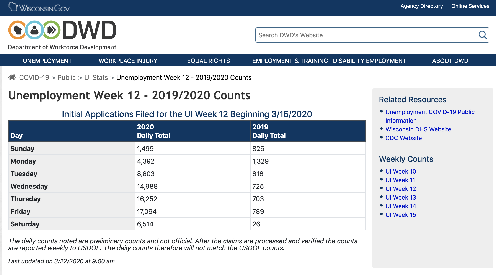
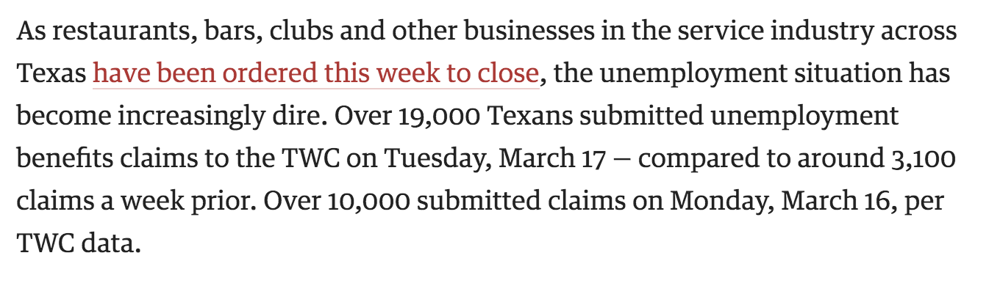
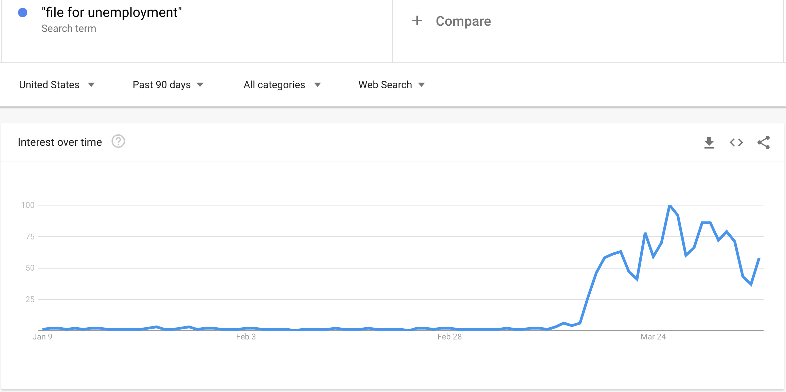
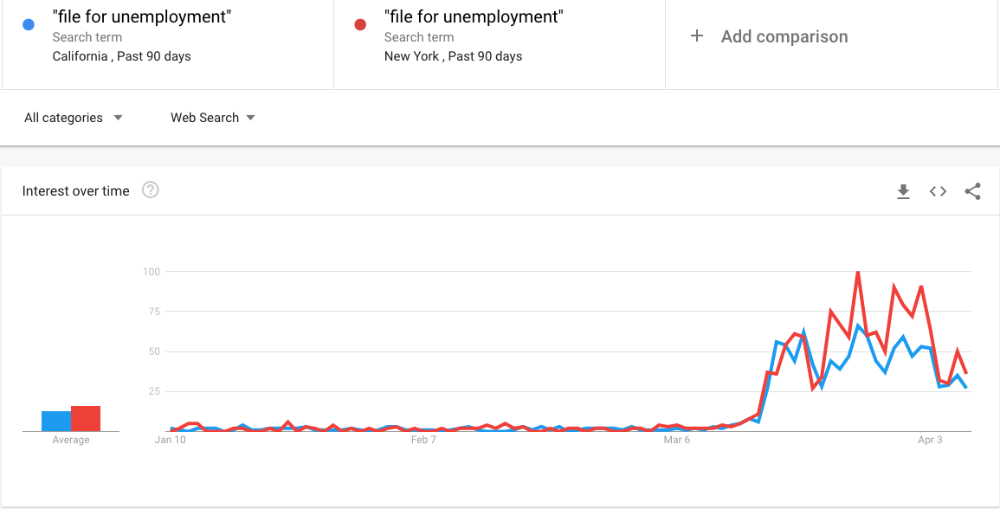
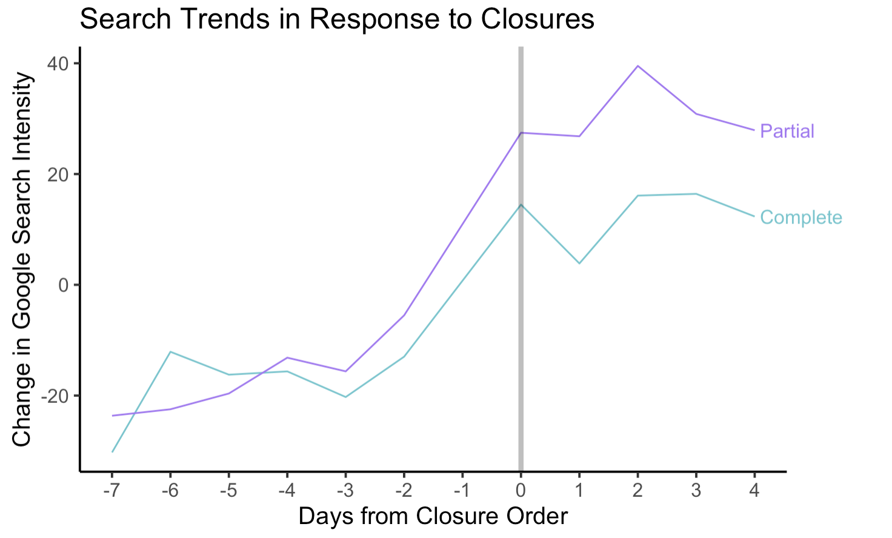

```{r setup, include=FALSE}
knitr::opts_chunk$set(echo = FALSE)
library(tidyverse)
library(tidyquant)
library(knitr)
library(ggrepel)
library(lubridate)
library(kableExtra)
library(readxl)
library(gtsummary)
library(gtrendsR)
library(broom)

lm_eqn = function(m) {

  l <- list(a = format(coef(m)[1], digits = 2),
      b = format(abs(coef(m)[2]), digits = 2),
      r2 = format(summary(m)$r.squared, digits = 3));


    eq <- substitute(~~italic(R)^2~"="~r2,l)
    eq <- substitute(~~italic(R)^2~"="~r2,l)    

  as.character(as.expression(eq));                 
}
```

<style type="text/css">
  .reveal h1 {
    text-align: left;
  }
  .reveal h2 {
    text-align: left;
  }
  .reveal h3 {
    text-align: left;
  }
  .reveal p {
    text-align: left;
  }
  .reveal ul {
    display: block;
  }
  .reveal ol {
    display: block;
  }
  

</style>


<section class=center>

## Predicting Initial Unemployment Insurance Claims\ 
## Using Google Trends

### <b>Paul Goldsmith-Pinkham, Elizabeth Pancotti, Aaron Sojourner</b>
#### Thanks to Minneapolis Fed's Opportunity and Inclusive Growth Institute\
#### And Dylan Piatt and Zach Swaziek for their help
</section>

<section class=bottom>


</section>


```{r, cache=TRUE, results='hide', show=FALSE, include=FALSE}

pull_data = function(loc, time_window, panel=FALSE) {
  if (panel==TRUE) {
    geo = c("US-CA",loc)
    res_post = gtrends(keyword=c("file for unemployment"),  geo = geo, 
                       time = time_window, onlyInterest = TRUE)
    state_data = res_post$interest_over_time %>%
      mutate(hits = as.numeric(hits)) %>%
      mutate(hits = replace_na(hits, 0))
    cutoff = dim(res_post$interest_over_time)[1]/length(geo)
    CA_max = state_data %>% filter(row_number() <= cutoff) 
    ## We do the filter thing to drop the comparison state out. 
    state_data = state_data %>% filter(row_number() > cutoff) %>% 
      group_by(geo) %>% 
      mutate(max_geo = max(hits), 
             scale = max_geo / max(CA_max$hits),
             hits = scale*hits)
    return(list(state_data = state_data))
  }
  else {
    geo = loc
    res_post = gtrends(keyword=c("file for unemployment"),  geo = geo, 
                       time = time_window, onlyInterest = TRUE)
    state_data = res_post$interest_over_time %>%
      mutate(hits = as.numeric(hits))
    return(list(state_data = state_data))    
  }
}

data_states_short = read_csv("../data/data_states_2020_02_01_2020_04_10a.csv") 
national_trend =  pull_data(loc = c("US"), time_window="2020-2-01 2020-4-10", panel=TRUE)
national_trend = national_trend$state_data %>% filter(geo == "US")  %>% 
  mutate(location = "USA") %>%
  ungroup() %>%
  select(date, hits, location) %>% mutate(date = date(date))

gg_color_hue <- function(n) {
  hues = seq(15, 375, length=n+1)
  hcl(h=hues, l=65, c=100)[1:n]
}
state_labels = data_states_short %>% 
  arrange(location, date) %>%
  group_by(location) %>%
  filter(!is.na(hits)) %>%
  filter(row_number() == n()) 

weekly_data = data_states_short %>% mutate(dow = wday(date)) %>%
  mutate(week = epiweek(date)) %>% group_by(week, dow, location) %>% 
  summarize(hits = mean(hits, na.rm= TRUE), date = max(date)) %>% filter(month(date) > 1)
weekly_data2 = data_states_short %>% 
  mutate(week = epiweek(date)) %>% group_by(week, location) %>% 
  summarize(hits = mean(hits, na.rm= TRUE), date = max(date)) %>% filter(month(date) > 1)
weekly_data3 = data_states_short %>% bind_rows(national_trend) %>%
  mutate(week = epiweek(date)) %>% group_by(week, location) %>% 
  summarize(hits = mean(hits, na.rm= TRUE), date = max(date)) %>% filter(month(date) > 1)

growth_rate_weekly = weekly_data %>% 
   filter(week >= 8 & week < 15 ) %>%
  select(location, hits = hits, week, date, dow) %>%
  mutate(late = case_when(week == 12 ~ "late",
                          week == 13 ~ "late_nyt",
                          week == 14 ~ "late_next",
                          TRUE ~ "early")) %>%
  group_by(location, late, dow) %>%
  summarize(hits = mean(hits, na.rm=TRUE)) %>%
  filter(!is.na(hits)) %>% spread(late, hits) %>%
  mutate(rate = late/(early+1),
         diff = late - early)

growth_rate_weekly2 = weekly_data2 %>% group_by(location) %>% 
   filter(week >= 8 & week < 13) %>%
  select(location, hits = hits, week, date) %>%
  mutate(late = case_when(week == 12 ~ "late",
                          TRUE ~ "early")) %>%
  group_by(location, late) %>%
  summarize(hits = mean(hits, na.rm=TRUE)) %>%
  filter(!is.na(hits)) %>% spread(late, hits) %>%
  mutate(rate = late/(early+1),
         diff = late - early)

growth_rate_weekly3 = weekly_data3 %>% 
   filter(week >= 8 & week < 15 ) %>%
  select(location, hits = hits, week, date) %>%
  mutate(late = case_when(week == 12 ~ "late",
                          week == 13 ~ "late_nyt",
                          week == 14 ~ "late_next",
                          TRUE ~ "early")) %>%
  group_by(location, late) %>%
  summarize(hits = mean(hits, na.rm=TRUE)) %>%
  filter(!is.na(hits)) %>% spread(late, hits) %>%
  mutate(rate = late/(early+1),
         diff = late - early)


```


```{r, cache=TRUE, results='hide', show=FALSE, include=FALSE}
### Load UI data

UI_Claims_March21 <- read_excel("../data/UI_Claims_March21.xlsx", skip = 1) %>% 
  filter(!is.na(State)) %>% select(location = State, ui_growth = GrowthFactor, baseline_ui = `2/22-3/14`)
UI_Claims_March28 <- read_excel("../data/UI_Claims_March28.xlsx", sheet = "Weekly_Summary", col_names = FALSE, skip = 4) %>%
  select(location = ...1, baseline_ui =...2, proj_ui_lastwk = ...4, proj_ui_thiswk =...5) %>%
  filter(!is.na(location))  %>%
  mutate(baseline_ui = as.numeric(baseline_ui),
         proj_ui_lastwk = as.numeric(proj_ui_lastwk),
         proj_ui_thiswk = as.numeric(proj_ui_thiswk))

### Load in Daily UI Data

daily_UI_Claims = tibble()
for (i in c(state.abb,"DC")) {
  daily_UI_Claims = daily_UI_Claims %>% bind_rows(
    read_excel("../data/UI_Claims_March28.xlsx", sheet = i) %>%
      select(date, ui_claims_daily = reported_claims...2) %>%
      mutate(location = i))
}

daily_UI_Claims = daily_UI_Claims %>% filter(!is.na(ui_claims_daily)) %>%
  mutate(date = date(date))

### Load in true State Data

UI_Claims_March21_True <- read_excel("../data/UI_20200326_states.xlsx") %>%
  left_join(tibble(STATE = state.name, location = state.abb)) %>%
  mutate(location = replace_na(location, "DC")) %>%
  select(location, Advance)

UI_Claims_March28_True <- read_excel("../data/StateUIClaims03282020.xlsx", sheet = "Sheet1") %>%
  left_join(tibble(STATE = state.name, location = state.abb)) %>%
  select(location, `2 week total`, advance_0322, advance_0315, updated_0315) %>%
  mutate(location = replace_na(location, "DC"))

UI_Claims_April04_True <- read_excel("../data/StateUIClaims_04052020.xlsx", sheet = "WE200404") %>%
  left_join(tibble(STATE = state.name, location = state.abb)) %>%
  select(location, advance_0404=Advance, updated_0322=`Prior Wk`) %>%
  mutate(location = replace_na(location, "DC"))


## Read in Labor force data

lf_state <- read_excel("../data/labor_force_state.xlsx", sheet = "Sheet1") %>%
  left_join(tibble(state = state.name, location = state.abb)) %>%
  mutate(location = replace_na(location, "DC")) %>%
  select(location, labor_force = lf_022020)

report_level_UI_data_raw <- read_excel("../data/UIClaims_Reports_new.xlsx", 
                                                        sheet = "zs") %>%
  mutate(date_start = date(date_start),
         date_end = date(date_end),
         article_date = janitor::excel_numeric_to_date(as.numeric(article_date))
         )
  
report_level_UI_data_raw <- report_level_UI_data_raw %>%
  bind_rows(read_excel("../data/UIClaims_Reports_new.xlsx", 
                                                        sheet = "dp") %>%
  mutate(date_start = date(date_start),
         date_end = date(date_end),
         article_date = janitor::excel_numeric_to_date(as.numeric(article_date))
         ))

report_level_UI_data = report_level_UI_data_raw %>% 
  rename(location = state) %>%
  filter(!is.na(date_start) & !is.na(date_end)) %>%
  group_by(location, date_start, date_end, source_specificity) %>%
  summarize(claims = mean(claims)) %>%
  group_by(location) %>% 
  mutate(report_id = row_number())
report_level_UI_data_fill = report_level_UI_data %>%
  mutate(num_days =1 + date_end - date_start ) %>% 
  mutate(claims_avg = claims / as.numeric(num_days)) %>%
  select(-claims, -num_days) %>% 
  gather(date_, date, -location, -claims_avg, -report_id, -source_specificity) %>% 
  select(-date_) %>% 
  arrange(location, report_id, date) %>% 
  group_by(location, report_id) %>% 
  complete(date = seq.Date(from = min(date), to = max(date), by="day"), claims_avg, source_specificity) %>%
  group_by(location, report_id, date, source_specificity) %>% 
  summarize(claims_avg = mean(claims_avg, na.rm=TRUE))

report_UI_GT_data = report_level_UI_data_fill %>% 
  left_join(data_states_short) %>% group_by(location, report_id, source_specificity) %>%
  summarize(claims = mean(claims_avg), hits = mean(hits), week_end = max(date), week_start = min(date)) %>% 
  left_join(growth_rate_weekly3 %>% select(location, early)) %>%
  mutate(hits_norm = hits - early) %>%
  left_join(UI_Claims_March21 %>% select(location, baseline_ui)) %>%
  mutate(ui_norm = claims / baseline_ui)

```


```{r,  results='hide', show=FALSE, include=FALSE}
plot_data_ntl = national_trend %>% mutate(date = date(date)) %>%
  filter(date >= ymd("2020-02-22") & date <= ymd("2020-04-10")) %>%
  mutate(location = "USA") %>%
  bind_rows(data_states_short %>% filter(date >= ymd("2020-02-22")) %>% 
              filter(location %in% c("NY", "CA", "OH", "PA", "MI", "FL", "AZ")))

plot_data_ntl$location <- relevel(as.factor(plot_data_ntl$location), "USA")
dates = plot_data_ntl %>% select(date) %>% unique()
sats <- which( wday(dates$date)==7)
suns <- which(wday(dates$date)==1)

google_trends_ts <- ggplot() + 
  geom_line(data = plot_data_ntl, aes(y = hits, x = date(date), 
                                      color= as.factor(location)),
            alpha = 0.8,
            size = 2,
            show.legend=FALSE) +
  scale_x_date(date_breaks = "7 days", date_labels = "%m-%d") +
  geom_text_repel(data = plot_data_ntl %>% group_by(location) %>% filter(row_number() == n()), 
                  aes(y = hits, x = date, label = location, color=location),
                  size = 10,
                  nudge_x = 1.5, show.legend=FALSE) +
  geom_rect(aes(xmin=dates$date[sats[1]], xmax=dates$date[suns[1]],
                  ymin=-Inf, ymax=Inf),
            fill='grey', alpha=0.25) +
  geom_rect(aes(xmin=dates$date[sats[2]], xmax=dates$date[suns[2]],
                  ymin=-Inf, ymax=Inf),
            fill='grey', alpha=0.25) +
  geom_rect(aes(xmin=dates$date[sats[3]], xmax=dates$date[suns[3]],
                  ymin=-Inf, ymax=Inf),
            fill='grey', alpha=0.25) +
  geom_rect(aes(xmin=dates$date[sats[4]], xmax=dates$date[suns[4]],
                  ymin=-Inf, ymax=Inf),
            fill='grey', alpha=0.25) +
  geom_rect(aes(xmin=dates$date[sats[5]], xmax=dates$date[suns[5]],
                  ymin=-Inf, ymax=Inf),
            fill='grey', alpha=0.25) +
    geom_rect(aes(xmin=dates$date[sats[6]], xmax=dates$date[suns[6]],
                  ymin=-Inf, ymax=Inf),
            fill='grey', alpha=0.25) +
      geom_rect(aes(xmin=dates$date[sats[7]], xmax=dates$date[suns[7]],
                  ymin=-Inf, ymax=Inf),
            fill='grey', alpha=0.25) +
  theme_classic(base_size=24) +
  scale_color_manual(values = c(  "black", gg_color_hue(7)))+
  labs(x = "Date",
       y = "",
       title="Daily Google search intensity  for 'File for unemployment'",
       subtitle = "From 2020-2-22 to 2020-4-04, highlighting national trend and select states",
       caption = "Weekends shaded",
       color = "Search Regions"
  ) 

cbscheme <- c("#E69F00", "#0072B2", "#D55E00")

date_labels = c("01/05-\n01/11",
                "01/12-\n01/18",
                "01/19-\n01/25",
                "01/26-\n02/01",
                "02/02-\n02/08",
                "02/09-\n02/15",
                "02/16-\n02/22",
                "02/23-\n02/29",
                "03/01-\n03/07",
                "03/08-\n03/14",
                "03/15-\n03/21",
                "03/22-\n03/28",
                "03/29-\n04/04")
icsa_data = read_csv("../data/ICSA.csv") %>% 
  bind_rows(tibble(DATE = ymd("2020-04-04"), ICSA = 6606000)) %>%
  mutate(week_start = DATE - 6, week_end = DATE) %>% 
  mutate(range = interval(week_start, week_end)) %>%
  filter(year(DATE) > 2019) %>% filter(row_number() != 1)

date_levels = levels(as.factor(icsa_data$range))

 icsa_data = icsa_data %>% 
   mutate(range = factor(range, levels = date_levels, labels = date_labels, ordered = TRUE)) 


icsa_plot = ggplot() + 
  geom_col(data = icsa_data %>% filter(row_number() < n()-2), 
           aes(y = ICSA, x = range), fill = cbscheme[1]) +
  geom_col(data = icsa_data %>% filter(row_number() == n() - 2), 
           aes(y = ICSA, x = range), fill = NA, width=0.9) +
    geom_col(data = icsa_data %>% filter(row_number() == n() -1), 
           aes(y = ICSA, x = range), fill = NA, width=0.9) +
    geom_col(data = icsa_data %>% filter(row_number() == n() ), 
           aes(y = ICSA, x = range), fill = NA, width=0.9) +
  scale_y_continuous(label=scales::comma) +
  #scale_y_log10() +
  #scale_x_date(date_breaks = "1 week", date_labels = "%b %d", expand = c(0,0))+ 
  theme_classic(base_size = 24) +
  labs(y="",
       title="Initial Unemployment Insurance Claims, Seasonally Adjusted", 
       x = "Date")
```

---

# Goal: forecasting new uninsurance claims 

Initial unemployment insurance (UI) claims count is one of the most-sensitive, high-frequency official statistics used to detect changes in the labor market. 

However, official federal data on UI claims comes out at a weekly interval and at a lag. 

```{r, fig.width=16}
icsa_plot +
  annotate("text", x = 11, y = 3000000, label="?", size = 24) 


```

---

# Goal: forecasting uninsurance claims 

Initial unemployment insurance (UI) claims count is one of the most-sensitive, high-frequency official statistics used to detect changes in the labor market. 

However, official federal data on UI claims comes out at a weekly interval and at a lag. 

```{r, fig.width=16}
icsa_plot +
  annotate("text", x = 11, y = 3000000, label="?", size = 24) +
  geom_vline(xintercept = 12, color = cbscheme[2], size=3) +
  annotate("text", x = 11.9, y = 6000000, label="Advance Data Release", 
           size = 10, hjust="right", color = cbscheme[2]) 

```


---

# Goal: forecasting new uninsurance claims 

Initial unemployment insurance (UI) claims count is one of the most-sensitive, high-frequency official statistics used to detect changes in the labor market. 

However, official federal data on UI claims comes out at a weekly interval and at a lag. 

```{r, fig.width=16}
icsa_plot + 
  geom_col(data = icsa_data %>% filter(row_number() == n() - 2), 
           aes(y = ICSA, x = range), fill = cbscheme[2], width=0.9) +
  annotate("text", x = 12, y = 3000000, label="?", size = 24) 
```

---

# Goal: forecasting new uninsurance claims 

Initial unemployment insurance (UI) claims count is one of the most-sensitive, high-frequency official statistics used to detect changes in the labor market. 

However, official federal data on UI claims comes out at a weekly interval and at a lag. 

```{r, fig.width=16, warnings = FALSE}
icsa_plot + 
  geom_col(data = icsa_data %>% filter(row_number() == n() - 2), 
           aes(y = ICSA, x = range), fill = cbscheme[2], width=0.9) +
      geom_col(data = icsa_data %>% filter(row_number() == n()-1 ), 
           aes(y = ICSA, x = range), fill = cbscheme[3], width=0.9) +
    geom_col(data = icsa_data %>% filter(row_number() == n() ), 
           aes(y = ICSA, x = range), fill = cbscheme[3], width=0.9)
```


---

# How to forecast UI claims? 

<div class="column-left">

<b>Difficulties:</b>

1. Training data arrives at weekly intervals
    - Limited number of data points
    - Low resolution for fast changes
2. UI data arrives with a lag
    - Pure time series forecasting is already late 
</div>
<div class="column-right">

<b>Solutions:</b>

1. Construct training data at higher frequency
    - Use news reports and states' posted daily UI claims

2. High frequency Google Trends data
    - (Nearly) immediate information on demand for UI filings
</div>

---

# Measuring daily UI claims through news reports

Many states reported various UI claims statistics over the course of the recent weeks. 

- Example: "the State received 10,394 claims on Monday and Tuesday."

Reconcile these differences in reporting dates by using a report-level dataset

- each reported statement is treated as an observation

---

# Example Source - Wisconsin Department of Labor



---

# Example Source - Houston Business Journal




---

# Report-level data

## Texas

```{r}
report_UI_GT_data %>% select(State = location, report_id, claims, 
                             report_start=week_start, report_end=week_end) %>%
  mutate(claims = round(claims)) %>%
  filter(State == "TX") %>%
  kable(col.names = c("State", "Report ID", "Reported Claims", 
                      "Start of Reported Dates", "End of Reported Dates"),
        format.args = list(big.mark = ",", scientific = FALSE)) %>%
  kable_styling(bootstrap_options = c("striped", "hover"), full_width = F) 
```

Report-level data available here:

- https://preview.tinyurl.com/uydyqup


---

# Google Trends


Data index on search volumes across locations and time 

http://www.google.com/trends  - Stephens-Davidowitz and Varian (2015)


---

# Google Trends - "file for unemployment"



---


# Google Trends - California and New York



---


# Google Trends - Michigan and New York


---


# Google Trends -  an index of search interest

## Problems:

1. Locations + time need to be compared to one another (raw levels are not provided)
2. Google Trends does not allow comparison of more than 5 locations over time
3. Too low of volume is compressed to 0. 

## Solution:

1. Focus on states to ensure sufficient data
    - Caveat: some states are still poorly measured (e.g. Alaska)
2. Compare all states to a baseline state (California) and renormalize relative to that state

Code to do this for any search term: https://github.com/paulgp/GoogleTrendsUINowcast

---


# Google Trends panel of state activity


```{r, warning=FALSE,  fig.width=16, fig.height=9, message=FALSE}
google_trends_ts
```

---


# Estimating Predictive Model

Goal is to predict UI claims per week. 

We proceed in two steps:

1. Estimation data constructed in report-level data, normalized to "daily" levels
2. Estimate growth in UI claims at state level relative to baseline growth in Google Index changes
$$\mathbb{E}\left(\text{UI Growth}_{it} \middle| \Delta\textrm{Google Index}_{it} \right)  = \alpha + \beta \Delta\textrm{Google Index}_{it} $$

     
---

# Estimating Predictive Model: Restrict to Early Data


```{r, warning=FALSE,  fig.width=13, fig.height=7, message=FALSE}
train_data = report_UI_GT_data %>% 
  left_join(report_level_UI_data %>% select(report_id, source_specificity)) %>%
  filter(epiweek(week_start) > 11 & epiweek(week_end) <= 12) %>%
  #filter(location != "HI") %>%
  filter(!is.na(hits))

ggplot(data =train_data ) +
  geom_text(aes(y = ui_norm, x = hits_norm,
                 size = baseline_ui, label = location), show.legend = FALSE) +
  geom_smooth(aes(y = ui_norm, x = hits_norm, weight = baseline_ui), method = "lm") +
  theme_classic(base_size=24) +
  theme(
  strip.background = element_blank(),
  #strip.text.x = element_blank()
  strip.text = element_text(size=10)
  ) +
  labs(x = "Change in Google Search Intensity",
       y = "Growth in UI Filings",
       title="Daily Google search intensity vs. UI Claims",
       subtitle = "Daily data from week ending 2020-3-22",
       size = "Baseline UI Claims",
       color = "UI Reporting Week"
  ) +
  annotate("text", x = -Inf, y = Inf, hjust = 0, vjust = 1,
           label = lm_eqn(lm(ui_norm ~ hits_norm, train_data, w = baseline_ui)), 
           parse = TRUE, size=10)+
  xlim(0,200) + ylim(0,8.5)
```

---

# Estimating Predictive Model

Number of different ways we can estimate this model

We have focused on simplest case: use data from just 3/15-3/22

Given more data now, can do additional estimation and compare


```{r, warning=FALSE, message = FALSE, fig.width=15, fig.height=8}


model.1.lm = lm(ui_norm ~ hits_norm, weights = baseline_ui,
             data = report_UI_GT_data %>%
  filter(epiweek(week_start) > 11 & epiweek(week_end) <= 12) %>%
  filter(!is.na(hits)))
model.1 = model.1.lm %>%
   tidy() %>% 
  select(-p.value, -statistic) %>%
  gather(stat, value, - term) 
  # # arrange(term, stat) %>%
  # # mutate(value_print = as.character(round(value,digits=3))) %>%
  # # mutate(left = case_when(stat == "std.error" ~ "(", 
  # #                                TRUE ~ "")) %>%
  # # mutate(right = case_when(stat == "std.error" ~ ")", 
  # #                                TRUE ~ "")) %>%
  # # unite(value_print, c(left, value_print, right), sep="") %>%
  # select( -value) %>% rename(model1 = value_print)

model.2.lm = lm(ui_norm ~ hits_norm, weights = baseline_ui,
             data = report_UI_GT_data %>%
  filter(epiweek(week_start) > 12 & epiweek(week_end) <= 13) %>%
  filter(!is.na(hits))) 

model.2 = model.2.lm %>%
   tidy() %>% 
  select(-p.value, -statistic) %>%
  gather(stat, value, - term) 
  # arrange(term, stat) %>%
  # mutate(value_print = as.character(round(value,digits=3))) %>%
  # mutate(left = case_when(stat == "std.error" ~ "(", 
  #                                TRUE ~ "")) %>%
  # mutate(right = case_when(stat == "std.error" ~ ")", 
  #                                TRUE ~ "")) %>%
  # unite(value_print, c(left, value_print, right), sep="") %>%
  # select( -value) %>% rename(model2 = value_print)

model.3.lm = lm(ui_norm ~ hits_norm, weights = baseline_ui,
             data = report_UI_GT_data %>%
  filter(epiweek(week_start) > 13 & epiweek(week_end) <= 14) %>%
  filter(!is.na(hits))) 

model.3 = model.3.lm %>%
   tidy() %>% 
  select(-p.value, -statistic) %>%
  gather(stat, value, - term) 

model.4.lm = lm(ui_norm ~ hits_norm, weights = baseline_ui,
             data = report_UI_GT_data %>%
  filter(epiweek(week_start) > 11 & epiweek(week_end) <= 14) %>%
  filter(!is.na(hits))) 

model.4 = model.4.lm %>%
   tidy() %>% 
  select(-p.value, -statistic) %>%
  gather(stat, value, - term) 


model.5.lm = lm(ui_norm ~ hits_norm, weights = baseline_ui,
             data = report_UI_GT_data %>%
  filter(epiweek(week_start) > 11 & epiweek(week_end) <= 14) %>%
    filter(source_specificity== "daily" | source_specificity == "days") %>%
  filter(!is.na(hits))) 

model.5 = model.5.lm %>%
   tidy() %>% 
  select(-p.value, -statistic) %>%
  gather(stat, value, - term) 

model_list = list(list())
for (d in seq.Date(as.Date("2020-03-16"), as.Date("2020-04-04"), by="day")) {
  i = which(seq.Date(as.Date("2020-03-16"), as.Date("2020-04-04"), by="day") == d)
  
  m_roll = lm(ui_norm ~ hits_norm, weights = baseline_ui,
                     data = report_UI_GT_data %>%
                       filter(epiweek(week_start) > 10 & week_end < as_date(d)) %>%
                       # filter(source_specificity== "daily" | source_specificity == "days") %>%
                       filter(!is.na(hits))) 
  model_list[[i]] = tidy(m_roll, robust=TRUE) %>% mutate(model_date = as_date(d)) %>% 
    left_join(glance(m_roll) %>% select(r.squared) %>% mutate(model_date = as_date(d)))
}

model_list = bind_rows(model_list)


output_plot = model.1 %>% mutate(model = "model1", r2 = glance(model.1.lm)$r.squared[1]) %>%
  bind_rows(model.2  %>% mutate(model = "model2", r2 = glance(model.2.lm)$r.squared[1])) %>% 
  bind_rows(model.3  %>% mutate(model = "model3", r2 = glance(model.3.lm)$r.squared[1])) %>% 
  bind_rows(model.4  %>% mutate(model = "model4", r2 = glance(model.4.lm)$r.squared[1])) %>% 
  bind_rows(model.5  %>% mutate(model = "model5", r2 = glance(model.5.lm)$r.squared[1])) %>% 
    spread(stat, value) %>%
  mutate(model = factor(model, levels = c("model1", "model2", "model3", "model4", "model5"),
                        labels = c("3/15-3/21",
                                   "3/22-3/28",
                                   "3/29-4/4",
                                   "All Data",
                                   "All Data, \n Daily only"))) 
  
sample_plot = ggplot(data= output_plot %>% filter(term == "hits_norm")) +
  geom_pointrange(aes(y = estimate, ymin =  estimate- 2*std.error, 
                      ymax = estimate+ 2*std.error , x = model), size = 1) +
  geom_text(aes(y = Inf , x = model, label = round(r2,digits=3)), hjust="right", size=8) +
  annotate("text", x=Inf, y = Inf, label="R2 of Model", hjust="right", vjust="top", size = 8) +
  theme_classic(base_size=24) +
  coord_flip() +
  labs(x= "Sample Period", y = "Estimated response of UI Claims to Google Trends") +
  ylim(c(0,0.07))
  
coef_plot = ggplot(data= model_list %>% filter(term == "hits_norm")) +
  geom_pointrange(aes(y = estimate, ymin =  estimate- 2*std.error, 
                      ymax = estimate+ 2*std.error , x = model_date), size = 1) +
  theme_classic(base_size=24) +
  labs(x= "End of Sample Period", y = "",
       title = "Estimated coefficient from cumulative rolling window") 

r2_plot = ggplot(data= model_list %>% filter(term == "hits_norm")) +
  geom_line(aes(y = r.squared, x = model_date), size = 1) +
  theme_classic(base_size=24) +
  labs(x= "End of Sample Period", y = "",
       title = "Model R-squared from cumulative rolling window") 

```

---

# Estimating Model: Rolling Estimation

Will focus on using data from March 28th onwards

```{r, fig.width = 14, fig.height=7}
coef_plot
```

---

# Estimating Model: Rolling Estimation

Will focus on using data from March 28th onwards

```{r, fig.width = 14, fig.height=7}
r2_plot
```


---

# Prediction and validation

We scale our predicted growth rates back by baseline UI claims rates, and calculate weekly UI claims predictions.


```{r, include=FALSE, message=FALSE, warning=FALSE, cache = FALSE}
model_report_daily = model.5.lm


daily_predict_data = data_states_short %>% 
  filter(epiweek(date) > 11 & epiweek(date) < 16) %>%
  mutate(dow = wday(date)) %>%
  left_join(growth_rate_weekly %>% 
              select(location, early, dow)) %>%
  left_join(UI_Claims_March28 %>% 
              select(baseline_ui, location) %>% 
              group_by(location) %>% 
              filter(row_number() == n())) %>%
  mutate(hits_norm = hits - early) %>%
  mutate(ui_claims_report_daily_hat = 
           baseline_ui*(
             ((hits_norm) * model_report_daily$coefficients[2]) + 
               model_report_daily$coefficients[1])
         ) 

se_report.fit = predict(model_report_daily, daily_predict_data %>% 
  mutate(week = epiweek(date)), se.fit = TRUE)$se.fit

weekly_predict_data = daily_predict_data %>% 
  mutate(week = epiweek(date))  %>%
  bind_cols(tibble(se_report = se_report.fit)) %>%
  mutate(se_report = se_report * baseline_ui) %>%
  left_join(report_level_UI_data_fill %>% 
              group_by(location, date) %>% 
              summarize(claims_avg = mean(claims_avg, na.rm = TRUE))) %>%
  mutate(combined_prediction_report =  ui_claims_report_daily_hat,
         combined_prediction_se_report = se_report) %>%
  select(location, date, hits, hits_norm,
         combined_prediction_report, combined_prediction_se_report, week) %>%
  group_by(location, week) %>%
  summarize(predicted_ui_report = sum(combined_prediction_report),
            predicted_ui_lb_report =  sum(combined_prediction_report) - 2*sum(combined_prediction_se_report),
            predicted_ui_ub_report =  sum(combined_prediction_report) + 2*sum(combined_prediction_se_report),
            first_date = first(date),
            last_date = last(date))%>%
  mutate(num_days = 1 + as.numeric((last_date- first_date)),
         predicted_ui_report = predicted_ui_report*(7/num_days),
         predicted_ui_lb_report = predicted_ui_lb_report*(7/num_days),
         predicted_ui_ub_report = predicted_ui_ub_report*(7/num_days))
         
predicted_vals_plot = weekly_predict_data %>% 
  ungroup() %>% filter(week  > 11) %>%
  mutate(predicted_ui = predicted_ui_report/1e6, 
         predicted_ui_lb = predicted_ui_lb_report/1e6,
         predicted_ui_ub = predicted_ui_ub_report/1e6) %>%
  mutate(predicted_ui_sa = case_when(week == 12 ~ predicted_ui/0.833,
                                     week == 13 ~ predicted_ui/0.876,
                                     week == 14 | week == 15 ~ predicted_ui*1.065),
         predicted_ui_lb_sa = case_when(week == 12 ~ predicted_ui_lb/0.833,
                                     week == 13 ~ predicted_ui_lb/0.876,
                                     week == 14 | week == 15 ~ predicted_ui_lb*1.065),
         predicted_ui_ub_sa = case_when(week == 12 ~ predicted_ui_ub/0.833,
                                     week == 13 ~ predicted_ui_ub/0.876,
                                     week == 14 | week == 15 ~ predicted_ui_ub*1.065)) %>%
  select(week, predicted_ui, predicted_ui_lb, predicted_ui_ub,
         ends_with("sa")) %>%
  group_by(week) %>% summarize_all(sum) %>%
  mutate(week = factor(week, levels = c(12,13,14,15), labels = c("3/15-3/21", "3/22-3/28", "3/29-4/04", "4/05-4/11")))


```

```{r, warning=FALSE, message = FALSE, fig.width=15, fig.height=7}
predicted_vals_plot2 = predicted_vals_plot %>% 
  select(week, ends_with("sa")) %>%
  left_join(tibble(week = factor(c(12,13,14,15),
                                 levels = c(12,13,14,15), 
                                 labels = c("3/15-3/21", "3/22-3/28", "3/29-4/04", "4/05-4/11")),
                   reported_ui = c(icsa_data %>% 
                                     filter(row_number() >= n() -2 ) %>%
                                   pull(ICSA)/1000000, NA))) %>%
  mutate(week = fct_rev(week))
ggplot(data = predicted_vals_plot2 ) +
  geom_pointrange(aes(y = predicted_ui_sa, ymin = predicted_ui_lb_sa,
                      ymax = predicted_ui_ub_sa, x = week), color = cbscheme[2], size =2) +
  geom_point(aes(y = reported_ui, x = week),  color = cbscheme[1], size = 6) +
   geom_text_repel(aes(y = predicted_ui_sa, x = week,  label = round(predicted_ui_sa,digits=1)), color = cbscheme[2], size = 6, nudge_x = -0.25) +
  geom_text_repel(aes(y = reported_ui, x = week,  label = round(reported_ui, digits = 1)), color = cbscheme[1], size = 6, nudge_x = 0.25) +
  ylim(c(0,9)) +
  theme_classic(base_size=24) +
  coord_flip() +
  labs(x= "Time Period", y = "Estimated National Claims, Seasonally Adjusted") +
  annotate("text", y = 3.307000, x = 3.7, label = "Official Estimates", size = 8, color = cbscheme[1]) +
  annotate("text", y = 4.95, x = 1.3, label = "Predicted Estimates", size = 8, color = cbscheme[2])
  
  
  
```

---

# Can do the same exercise cross-sectionally

Scale our predicted estimates by states' February labor force

```{r, warning=FALSE, message = FALSE, fig.width=15, fig.height=8}

plot_data = weekly_predict_data %>% left_join(lf_state) %>% 
  left_join(UI_Claims_March21 %>% select(baseline_ui, location)) %>%
  left_join(UI_Claims_March28_True  %>% 
              select(location, `12` = updated_0315) %>%
              gather(week, true_ui, -location) %>%
              mutate(week = as.numeric(week)) %>%
              bind_rows(UI_Claims_April04_True %>% 
              select(location, `14`= advance_0404,`13`= updated_0322 ) %>%
              gather(week, true_ui, -location) %>%
              mutate(week = as.numeric(week)))) %>%
 mutate(week = factor(week,
                      levels = c(12,13,14, 15), 
                      labels = c("3/15-3/21", "3/22-3/28", "3/29-4/04", "4/05-4/11")))
ggplot(data = plot_data %>% filter(!is.na(true_ui))) + 
  geom_pointrange(aes(x = true_ui / labor_force, 
                      y=  predicted_ui_report/labor_force,
                      ymin=  predicted_ui_lb_report /labor_force,
                      ymax=  predicted_ui_ub_report/labor_force,
                      color = as.factor(week))) +
    # geom_text_repel(aes(x = true_ui / labor_force, 
    #                   y=  predicted_ui_report/labor_force,
    #                   color = as.factor(week),
    #                   label=location)) +
  theme_classic(base_size=24) +
  coord_flip() +
  scale_color_discrete(labels = c("3/15-3/21", "3/22-3/28", "3/29-4/04")) +
  labs(x= "Reported UI Claims Per Worker", y = "Predicted UI Claims Per Worker",
       color= "Week of Prediction") +
  geom_abline(slope=1, intercept=0) +
   annotate("text", x = 0.07, y = 0.01, hjust = 0, vjust = 1, size=8,
           label = lm_eqn(lm(y ~ x, 
                             weight = labor_force,
                             plot_data %>% mutate(y = true_ui / labor_force,
                                                  x = predicted_ui_report/labor_force))), parse = TRUE)
  
  
```

---

# Can do the same exercise cross-sectionally

And combine our three weeks into one

```{r, warning=FALSE, message = FALSE, fig.width=15, fig.height=8}

True_total_states = UI_Claims_March28_True  %>% 
              select(location, `12` = updated_0315) %>%
              gather(week, true_ui, -location) %>%
              mutate(week = as.numeric(week)) %>%
              bind_rows(
                UI_Claims_April04_True %>% 
              select(location, `14`= advance_0404,`13`= updated_0322 ) %>%
              gather(week, true_ui, -location) %>%
              mutate(week = as.numeric(week))) %>%
  group_by(location) %>%
  summarize_all(sum)

plot_data = weekly_predict_data %>% 
  filter(week < 15) %>%
  select(location, ends_with("report")) %>%
  group_by(location) %>%
  summarize_all(sum) %>%
  left_join(lf_state) %>% 
  left_join(True_total_states
            )
ggplot(data = plot_data ) +
  geom_pointrange(aes(x = true_ui / labor_force, 
                      y=  predicted_ui_report/labor_force,
                      ymin=  predicted_ui_lb_report /labor_force,
                      ymax=  predicted_ui_ub_report/labor_force)) +
    geom_text_repel(aes(x = true_ui / labor_force, 
                      y=  predicted_ui_report/labor_force,
                      label=location)) +
  theme_classic(base_size=24) +
  coord_flip() +
  labs(x= "Reported UI Claims Per Worker", y = "Predicted UI Claims Per Worker",
       color= "Week of Prediction") +
  geom_abline(slope=1, intercept=0) +
   annotate("text", x = 0.12, y = 0.01, hjust = 0, vjust = 1, size=8,
           label = lm_eqn(lm(y ~ x, 
                             weight = labor_force,
                             plot_data %>% mutate(y = true_ui / labor_force,
                                                  x = predicted_ui_report/labor_force))), parse = TRUE)
  
  
```

---


# Additional uses beyond forecasting
## Estimate response in UI to shutdowns

<center>

</center>


---

# Conclusion

Across the 3 weeks, 5-7 days ahead of each official report, we are able to predict UI claims.

Given first two days of 4/05-4/11, we predict 4.73 [4.21-5.25] million additional claims.

```{r, fig.width=12, fig.height=6, warning = FALSE}
ggplot(data = predicted_vals_plot2 ) +
  geom_pointrange(aes(y = predicted_ui_sa, ymin = predicted_ui_lb_sa,
                      ymax = predicted_ui_ub_sa, x = week), color = cbscheme[2], size =2) +
  geom_point(aes(y = reported_ui, x = week),  color = cbscheme[1], size = 6) +
  geom_text_repel(aes(y = predicted_ui_sa, x = week,  label = round(predicted_ui_sa,digits=2)), color = cbscheme[2], size = 6, nudge_x = -0.25) +
  geom_text_repel(aes(y = reported_ui, x = week,  label = round(reported_ui, digits = 2)), color = cbscheme[1], size = 6, nudge_x = 0.25) +
  ylim(c(0,9)) +
  theme_classic(base_size=24) +
  coord_flip() +
  labs(x= "Time Period", y = "Estimated National Claims, Seasonally Adjusted")  +
  annotate("text", y = 4.95, x = 1.3, label = "This Week's Forecast", size = 8, color = cbscheme[2])

  
```


---

# Additional uses beyond forecasting
## Evaluating demand for UI?

```{r, warnings = FALSE, message=FALSE, fig.height= 7, fig.width=14}
StateUICapacity = read_excel("../data/StateUISystemCapacity.xlsx", sheet="CoreMeasures") %>%
  select(location = State, capacity_measure = Z_3CoreMeasures)
StateUIMode = read_excel("../data/StateUISystemCapacity.xlsx", sheet="ModeShare2019") %>%
  select(location = State, internet = Internet)

True_total_states = UI_Claims_March28_True  %>%
              select(location, `12` = updated_0315) %>%
              gather(week, true_ui, -location) %>%
              mutate(week = as.numeric(week)) %>%
              bind_rows(
                UI_Claims_April04_True %>%
              select(location, `14`= advance_0404,`13`= updated_0322 ) %>%
              gather(week, true_ui, -location) %>%
              mutate(week = as.numeric(week))) %>%
  group_by(location) %>%
  summarize_all(sum)

plot_data = weekly_predict_data %>%
  filter(week < 15) %>%
  select(location, ends_with("report")) %>%
  group_by(location) %>%
  summarize_all(sum) %>%
  left_join(lf_state) %>%
  left_join(True_total_states
            ) %>%
 mutate(resid = (predicted_ui_report-true_ui)/labor_force) %>%
  left_join(StateUICapacity) %>% left_join(StateUIMode)

plot_data = weekly_predict_data %>% left_join(lf_state) %>%
  left_join(UI_Claims_March21 %>% select(baseline_ui, location)) %>%
  left_join(UI_Claims_March28_True  %>%
              select(location, `12` = updated_0315) %>%
              gather(week, true_ui, -location) %>%
              mutate(week = as.numeric(week)) %>%
              bind_rows(UI_Claims_April04_True %>%
              select(location, `14`= advance_0404,`13`= updated_0322 ) %>%
              gather(week, true_ui, -location) %>%
              mutate(week = as.numeric(week)))) %>%
 mutate(week = factor(week,
                      levels = c(12,13,14, 15),
                      labels = c("3/15-3/21", "3/22-3/28", "3/29-4/04", "4/05-4/11"))) %>%
  mutate(resid = (predicted_ui_report-true_ui)/labor_force) %>%
  left_join(StateUICapacity) %>%
  group_by(location) %>%
  arrange(location, week) %>%
  mutate(lag_res = lag(resid))

ggplot(data = plot_data %>% filter(week == "3/29-4/04") ,
       aes(y = resid, x = lag_res)) +
  geom_text(aes(label=location), size = 8) +
  theme_classic(base_size=24) +
  labs(x= "Last Week Forecast Error", y = "This Week Forecast Error",
       title="Correlation of forecast error across weeks by state",
       color= "Week of Prediction")


```


